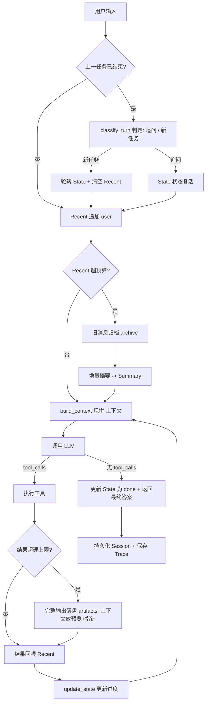

# Mini-Agent: 从零实现的最小可用 Agent

## 项目简介

本项目仅基于 `openai` SDK 与 DeepSeek API, 手写核心 Agent Runtime:

> 接收用户输入 → LLM 自主判断 "直接回答 or 调用工具" → 执行工具并把结果回喂 → 循环直至产出最终答案。

在**记忆机制**上，改变了原有的 "滑动窗口即丢弃" 做法，实现了 **Summary + State + Recent History 三层上下文**, 并配套**原始消息归档**与 `read_file`**&#x20;按需下钻**: 旧对话先归档、再增量摘要，任何细节都可追溯而不撑爆上下文。同时提供多窗口会话隔离、分层异常兜底、结构化 Trace 日志，以及一套不联网的 pytest 测试。

## 功能特性

* [ ] 从零手写 Agent Runtime, 无任何 Agent 框架

* [ ] 基本循环：接收输入 → 判断 → 调工具 → 决定继续或返回

* [ ] 7 个工具: `get_current_time`、`calculator`、`search`、`add_todo`、`delete_todo`、`all_todo`、`read_file`

* [ ] 装饰器工具注册机制：名称、描述、参数 JSON Schema 一处定义

* [ ] LLM 输出解析：提取思考过程、工具调用、最终答案

* [ ] Session 多窗口隔离 + JSON 持久化，重启后可接着任意窗口聊

* [ ] 最大轮次限制，防止死循环

* [ ] **三层上下文: System → Summary → State → Recent History**

* [ ] **粗粒度 token 估算，触发阈值由总预算倒推 (低频摘要)**

* [ ] **工具输出硬 token 上限，超限完整落盘、上下文只留预览 + 指针**

* [ ] **被裁原始消息归档到&#x20;**`data/archive/`**, 摘要内嵌归档指针**

* [ ] `read_file` **下钻工具 (目录白名单、豁免截断), 按需读回原文**

* [ ] **Todo 并发控制：filelock 文件锁事务 (加锁→重读→改→写回), 多进程 / 多线程同时写不覆盖**

* [ ] 任务边界判定：自动区分 "追问 / 重试" 与 "新任务", 新任务轮转 State、清空 Recent

* [ ] 分层异常处理（API / JSON 解析 / 工具执行 / 未知工具 / 外层兜底）

* [ ] 配置 fail-fast 校验（预算倒挂或为负即启动报错）

* [ ] 结构化工具调用 Trace（JSON 文件）

* [ ] pytest 测试套件（mock LLM, 覆盖核心路径与各容错分支）

## 项目结构

```
mini-agent/
├── main.py                # 程序入口,启动交互式 REPL
├── config.py              # 配置、上下文预算计算、LLM client、logger、fail-fast 校验
├── requirements.txt       # 依赖清单
├── .env.example           # 环境变量模板
├── .gitignore
├── agent/
│   ├── __init__.py
│   ├── runtime.py         # Agent 核心循环 agent_run
│   ├── repl.py            # 交互层: 窗口菜单 + 窗口内对话循环
│   ├── session.py         # Session(含 messages/state/summary) 与 SessionManager
│   ├── memory.py          # token 估算、trim 裁剪、build_context 上下文组装
│   ├── state.py           # State 模板、normalize_state、new_task_state
│   ├── state_updater.py   # update_state(进度更新) + classify_turn(任务边界判定)
│   ├── summarizer.py      # 增量摘要 summarize
│   ├── artifacts.py       # 落盘: save_artifact / cap_tool_result / archive_messages
│   ├── prompts.py         # 全部提示词(System / State 更新 / 任务判定 / 摘要)
│   └── trace.py           # Trace 事件收集与原子保存
├── tools/
│   ├── __init__.py
│   ├── registry.py        # Tool / ToolRegistry 装饰器注册
│   ├── builtin.py         # get_current_time
│   ├── calculator.py      # calculator
│   ├── search.py          # search(模拟知识库)
│   ├── todo.py            # add/delete/all_todo, filelock 事务防并发覆盖
│   └── files.py           # read_file(白名单下钻)
├── tests/
│   ├── __init__.py
│   ├── helpers.py         # 构造 mock LLM 响应的辅助函数
│   ├── test_registry.py   # 工具注册与 Schema 结构
│   ├── test_tools.py      # 各工具正常与异常分支、read_file 白名单
│   ├── test_memory.py     # token 估算、trim 裁剪、孤儿 tool 保护
│   ├── test_state.py      # State 结构、normalize、上下文分层组装
│   ├── test_state_updater.py # 状态更新与任务判定的容错
│   ├── test_summarizer.py # 增量摘要与归档指针
│   ├── test_artifacts.py  # 超长输出落盘、消息归档
│   ├── test_session.py    # Session 隔离与持久化往返
│   └── test_runtime.py    # Runtime 路径: 直接回答/工具循环/错误恢复/最大轮次/轮转/归档
├── data/                  # 运行时自动生成(不入库)
│   ├── sessions.json      # 全部会话: messages + state + summary
│   ├── todos.json         # 用户级待办
│   ├── artifacts/         # 超长工具完整输出
│   └── archive/<sid>/     # 被裁原始消息归档
└── logs/                  # 运行时自动生成: trace_*.json(不入库)
```

## 快速开始

### 1. 环境要求

**Python 3.10**

### 2. 创建并激活虚拟环境

在项目**根目录**执行:

```
python -m venv test_env
```

激活虚拟环境:

**Windows PowerShell:**

```powershell
test_env\Scripts\Activate.ps1
```

**Windows CMD:**

```cmd
test_env\Scripts\activate.bat
```

**Linux / macOS:**

```
source test_env/bin/activate
```

激活成功后，命令行提示符前会出现 `(test_env)`。退出虚拟环境执行 `deactivate`。

> Windows PowerShell 用户若激活时报 "无法加载脚本，因为在此系统上禁止运行脚本", 执行一次以下命令后重试:
>

```
Set-ExecutionPolicy -Scope CurrentUser RemoteSigned
```

### 3. 安装依赖

```
pip install -r requirements.txt
```

### 4. 配置 API Key

```
copy .env.example .env      # Windows
# cp .env.example .env      # Linux / macOS
```

编辑 `.env`, 填入 **DeepSeek API Key**。环境变量含义见下文 [上下文预算方案](#上下文预算方案)。

### 5. 运行

```
python main.py
```

启动后可新建窗口、选择历史窗口进入，窗口内输入 `/back` 返回菜单、`/quit` 退出程序。

### 6. 运行测试

```
pytest -v
```

## 系统设计

### 整体架构



### Agent 主循环

1. **任务边界判定**: 若上一任务 `done/blocked`, 先 `classify_turn` : 

   判断新消息是 "追问 / 重试"(`continue`, 状态复活) 还是 "新任务"(`new_task`, 轮转 State、清空 Recent);

   轮转state：把任务状态从旧任务切换到新任务

2. **接收输入**: 用户消息追加到 Recent;

3. **预算检查**: Recent 超硬触发线时，旧消息先归档、再增量摘要；

4. **调用 LLM**: `build_context` 现拼 System → Summary → State → Recent;

5. **工具执行**: 解析参数、分发执行；结果超硬上限则落盘、只回喂预览 + 指针；

6. **更新与收尾**: 工具轮后 `update_state`; 模型不再请求工具时更新 State 为 `done`、返回最终答案。

### 三层上下文与下钻

每次调用 LLM 时，上下文由 `build_context` **动态现拼**, 不直接持久化:

| 层           | 内容                                                 | 生命周期             | 职责         |
| ----------- | -------------------------------------------------- | ---------------- | ---------- |
| **System**  | 人设、工具使用边界                                          | 固定               | 约束模型行为     |
| **Summary** | 更早对话的浓缩，增量合并、内嵌归档指针                                | 整个会话，**跨任务保留**   | 保留跨任务的旧事实  |
| **State**   | `goal / status / progress / key_facts / next_step` | 当前任务，**新任务轮转重置** | 当前任务的目标与进度 |
| **Recent**  | 最近对话原文                                             | 滑动窗口，**新任务清空**   | 提供最近的原始细节  |

**下钻链路 (不丢任何信息):**

* 工具结果超 `TOOL_RESULT_TOKEN_LIMIT` → 全文落 `data/artifacts/`, 上下文放预览 + 路径；

* Recent 超预算被裁 → 原始消息落 `data/archive/<sid>/*.json`, 摘要在相应位置标注 `[归档: 路径]`;

* 模型需要细节时调用 `read_file` 读回原文。`read_file` 是受控下钻通道 (自带 `max_chars`), **豁免截断闸**—— 否则读回内容又被截、再落盘、再引导读取，会形成套娃死循环；

* `read_file` 带目录白名单 (仅 `data/`、`logs/`), 防止路径穿越。

**停止信号的权威性:** 任务是否结束以 `State.status` 为准 (由规则置 `done/blocked`), 而非摘要的叙述。摘要 prompt 明确要求严格区分 "已完成" 与 "计划中", 不得把意图 / 计划写成已完成，避免提前收尾或重复执行。

### 上下文预算方案

#### 模型基准 (官方规格)

`deepseek-flash` :

| 规格              | 值                          |
| --------------- | -------------------------- |
| 上下文窗口           | **1M tokens**              |
| 最大输出            | **384K(393216)**           |
| 思考模式            | 非思考 / 思考 (**默认开启**)        |
| `max_tokens` 默认 | 非思考 8K / 思考 64K (高强度 128K) |

#### 预算公式

总预算口径为 "**输入 + 输出**"。Recent 硬触发线由总预算倒推:

```
RECENT_TOKEN_LIMIT = CONTEXT_BUDGET
                   - RESERVED_OUTPUT_TOKENS   # 输出 + 思考预留
                   - SUMMARY_MAX_TOKENS       # 摘要层上限
                   - STATE_RESERVE_TOKENS     # State 安全余量

KEEP_RECENT_TOKENS = round(RECENT_TOKEN_LIMIT × 0.55)   # 一次裁约 45%
```

只有 Recent 逼近 `RECENT_TOKEN_LIMIT` 才触发裁剪 / 摘要，且一次裁约 45%, 从而**降低摘要频率**—— 摘要会浓缩掉自然的话轮停止信号，因此越少越好。

#### 默认值 (100K 保守起步)

| 参数                             | 默认值         | 说明                    |
| ------------------------------ | ----------- | --------------------- |
| `CONTEXT_BUDGET`               | `100000`    | 控成本先取 100K, 稳定后可上调    |
| `RESERVED_OUTPUT_TOKENS`       | `65536`     | 思考模式官方默认 64K, 取 65536 |
| `STATE_RESERVE_TOKENS`         | `4096`      | 1M 窗口下的安全余量           |
| `SUMMARY_MAX_TOKENS`           | `600`       | 单次摘要输出上限              |
| `RECENT_TOKEN_LIMIT`           | `29768`     | 上式现算                  |
| `KEEP_RECENT_TOKENS`           | `16372`     | 硬线 × 55%              |
| `TOOL_RESULT_TOKEN_LIMIT`      | `800`       | 单条工具结果硬上限             |
| `MAX_MESSAGES` / `KEEP_RECENT` | `20` / `12` | 条数安全网 (防大量极短消息)       |

#### 成本 vs 摘要频率 (三组现成方案)

100K 总预算里输出预留占 65K,Recent 只剩约 30K, 摘要仍偏频繁。可按取舍调整:

| 方案               | `CONTEXT_BUDGET` | `RESERVED_OUTPUT` | Recent 硬线   | 保留线    |
| ---------------- | ---------------- | ----------------- | ----------- | ------ |
| 100K + 思考 (默认起步) | 100,000          | 65,536            | **29,768**  | 16,372 |
| 200K + 思考        | 200,000          | 65,536            | **129,768** | 71,372 |
| 100K + 关思考       | 100,000          | 8,192             | **87,112**  | 47,912 |

#### fail-fast 校验

`config.py` 在启动时校验，配置错误**立即报错**而非静默空转:

* `RECENT_TOKEN_LIMIT <= 0`: 总预算盖不住各项预留，报错并提示调大 `CONTEXT_BUDGET`;

* `RECENT_TOKEN_LIMIT <= KEEP_RECENT_TOKENS`: 触发线必须高于保留线，否则 "触发却无消息可裁"。

#### 成本与监控

* 调大预算后单次输入成本上升，但摘要频率下降、调用次数减少，综合成本未必增加；

* 通过 API 返回的 `usage` 字段监控实际输入 / 输出 (含思考) token, 持续校准预算；

* 若经过第三方集成层，其可能设置更低的输入 / 输出硬限制，实际预算以集成层为准。

### 工具注册机制

* `Tool` 数据类聚合四要素: `name`、`description`、`parameters`（JSON Schema）、`func`;

* `@registry.register(...)` 装饰器在模块导入时一次性完成登记；

* `ToolRegistry` 提供 `schemas()`（给 LLM 的工具清单）、`execute()`（分发执行）、`__contains__`（成员判断）;

* 新增工具只需写一个函数并加装饰器，无需改动 Runtime。

### Session 管理

* `Session` 持有 `id`（uuid）、`name`、`messages`（Recent）、`state`、`summary`、时间戳；

* `SessionManager` 负责 `create / get / list_sessions / save_all / load_all`;

* 每个窗口持有独立的 Recent / State, 对话物理隔离；`summary` 同样按会话隔离；

* 持久化到 `data/sessions.json`（`.tmp + os.replace` 原子写入）, 启动自动 `load_all`;

* 加载旧存档时 `normalize_state` 补齐 / 校正 State (缺字段、类型非法、枚举越界均修复), 缺失的 `summary` 补空串。

**设计说明：对话隔离，用户数据共享。** Session 隔离的是对话上下文；todo 数据（`data/todos.json`）是用户级的 —— 待办清单天然只有一份。隔离指对话不串台，而非把用户数据强行割裂。

### Todo 持久化与并发控制

Todo 是**用户级数据**, 跨窗口共享同一份 `data/todos.json`, 不按窗口拆分 (否则 `all_todo` 看不到全貌)。

**并发问题：** 旧实现 "模块导入时读一次 → 改内存 → 整文件覆盖写", 在多进程 (开多个终端各跑一次程序) 下发生 lost update:

```
进程A: load [1,2] ─ 加3 ─▶ 写 [1,2,3]
进程B: load [1,2] ─ 加4 ─▶ 写 [1,2,4]   # A 的 3 被覆盖丢失
```

**事务方案 (filelock)：** `add_todo` / `delete_todo` 在一把 OS 文件锁 (`data/todos.json.lock`) 内完成 **加锁 → 从文件重读最新 → 修改 → 原子写回 → 释放**:

* 同一把锁同时覆盖**多进程** (OS 文件锁) 与**同进程多线程** (filelock 内部线程互斥);

* 抢锁超时 (`LOCK_TIMEOUT=10s`) 或任何异常都返回 `False`, 文件不会被写坏;

* 写失败时文件根本未变, 下个事务 `_load` 读到的即旧内容, **无需手动回滚内存**;

* `all_todo` 为只读、不加锁 —— `os.replace` 原子替换保证不会读到半截文件。

### 异常处理

| 位置                   | 风险                 | 处理策略             |
| -------------------- | ------------------ | ---------------- |
| LLM 请求               | 断网 / 限流 / Key 失效   | 捕获后返回明确错误，不崩溃    |
| 参数解析                 | arguments 非合法 JSON | 错误信息回喂模型，要求重新给出  |
| 工具执行                 | 参数类型错 / 工具内部报错     | 错误文本回喂，模型可自我修正   |
| 未知工具                 | 模型编造工具名            | 提示工具不存在          |
| State 更新 / 任务判定 / 摘要 | API 异常 / 输出非法      | 安全沿用旧值，不拖垮主流程    |
| Runtime 最外层          | 任何未预期异常            | 统一捕获，记录 fatal 事件 |

### Trace 日志

每轮运行收集结构化事件，结束写入 `logs/trace_*.json`, 事件类型包括:

`user`、`thought`、`assistant_content`、`tool_call`、`tool_call_error`、

`tool_result`、`tool_error`、`final`、`error`、`max_rounds`、`fatal`。

## 测试

测试通过 `MagicMock` 构造**假响应**、`monkeypatch` 替换 LLM 调用、`tmp_path` 隔离文件，覆盖:

* 工具注册与 Schema 结构、read\_file 白名单；

* Todo filelock 事务与多线程并发写入 (无丢失、编号唯一);

* token 估算、trim 裁剪与孤儿 tool 保护；

* State 结构、normalize、上下文分层组装；

* 状态更新 / 任务判定 / 增量摘要的各容错分支；

* 超长输出落盘、消息归档；

* Session 隔离与持久化往返；

* Runtime 路径：直接回答、工具循环、错误恢复、最大轮次、任务轮转、归档触发。

> Runtime 测试中 : 
>
>   `update_state`、`classify_turn`、`summarize`均被 mock, 避免额外调用吃掉假响应队列。

## 技术栈

* **Python 3.10** 

* openai SDK（对接 **DeepSeek API**, 模型 `deepseek-flash`）

* pytest、unittest.mock（测试）

* python-dotenv（密钥管理）

* logging（执行日志）
