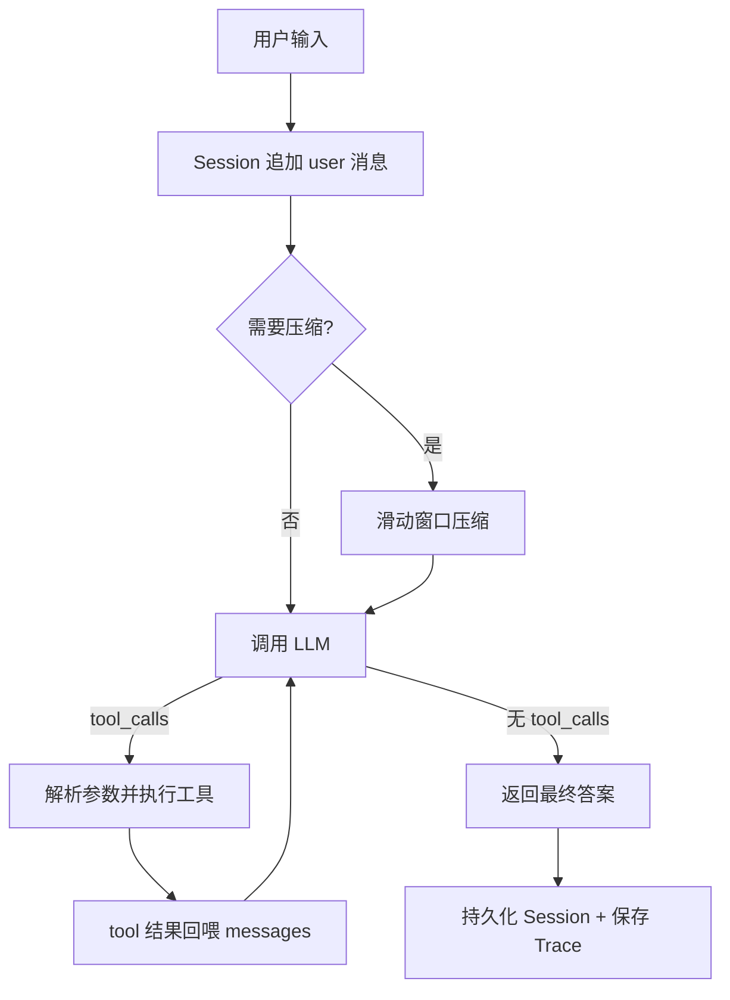

# Mini-Agent: 从零实现的最小可用 Agent

## 项目简介

本项目**不依赖 langgraph / openhands 等任何 Agent 框架**,仅基于 `openai` SDK 与 DeepSeek 真实 API,手写核心 Agent Runtime: 

> 接收用户输入 → LLM 自主判断"直接回答 or 调用工具" → 执行工具并把结果回喂 → 循环直至产出最终答案。

同时实现了多窗口会话隔离、上下文滑动窗口压缩、分层异常兜底、结构化 Trace 日志,并配有一套不联网的 pytest 测试。

## 功能特性

- [ ] 从零手写 Agent Runtime,无任何 Agent 框架
- [ ] 基本循环: 接收输入 → 判断 → 调工具 → 决定继续或返回
- [ ] 6 个工具: `get_current_time`、`calculator`、`search`、`add_todo`、`delete_todo`、`all_todo`
- [ ] 装饰器工具注册机制: 名称、描述、参数 JSON Schema 一处定义
- [ ] LLM 输出解析: 提取思考过程、工具调用、最终答案
- [ ] Session 多窗口隔离 + JSON 持久化,重启后可接着任意窗口聊
- [ ] 最大轮次限制,防止死循环
- [ ] 支持纯对话追问与带工具的追问
- [ ] 上下文滑动窗口压缩,保护 tool 消息配对
- [ ] 分层异常处理（API / JSON 解析 / 工具执行 / 未知工具 / 外层兜底）
- [ ] 结构化工具调用 Trace（JSON 文件）
- [ ] 使用真实 LLM API（DeepSeek）
- [ ] pytest 测试套件（mock LLM,覆盖核心路径）

## 项目结构

```
mini-agent/
├── main.py                 # 程序入口,启动交互式 REPL
├── config.py               # 配置、LLM client、logger
├── requirements.txt        # 依赖清单
├── .env.example            # 环境变量模板
├── .gitignore
├── agent/
│   ├── __init__.py
│   ├── runtime.py          # Agent 核心循环 agent_run
│   ├── repl.py             # 交互层: 窗口菜单 + 窗口内对话循环
│   ├── session.py          # Session / SessionManager,多窗口与持久化
│   ├── memory.py           # 上下文滑动窗口压缩
│   └── trace.py            # Trace 事件收集与原子保存
├── tests/
│   ├── __init__.py
│   ├── helpers.py          # 构造 mock LLM 响应的辅助函数
│   ├── test_registry.py    # 工具注册与 Schema 结构
│   ├── test_tools.py       # calculator / search / todo 正常与异常分支
│   ├── test_memory.py      # 压缩: system 保留与 tool 边界保护
│   ├── test_session.py     # Session 隔离与持久化往返
│   └── test_runtime.py     # Runtime 四条路径（直接回答/工具循环/错误恢复/最大轮次）
├── data/                   # 运行时自动生成: sessions.json、todos.json（不入库）
└── logs/                   # 运行时自动生成: trace_*.json（不入库）
```

## 快速开始

### 1. 环境要求

**Python 3.10.20**

### 2. 创建并激活虚拟环境

在项目**根目录**执行: 

```bash
python -m venv test_env
```

激活虚拟环境: 

**Windows PowerShell: **

```powershell
test_env\Scripts\Activate.ps1
```

**Windows CMD: **

```cmd
test_env\Scripts\activate.bat
```

**Linux / macOS: **

```bash
source test_env/bin/activate
```

激活成功后,命令行提示符前会出现 `(test_env)`。退出虚拟环境执行 `deactivate`。

> Windows PowerShell 用户若激活时报"无法加载脚本,因为在此系统上禁止运行脚本",执行一次以下命令后重试: 
> ```powershell
> Set-ExecutionPolicy -Scope CurrentUser RemoteSigned
> ```

### 3. 安装依赖

```bash
pip install -r requirements.txt
```

### 4. 配置 API Key

```bash
copy .env.example .env      # Windows
# cp .env.example .env      # Linux / macOS
```

编辑 `.env`,填入你的 **DeepSeek API Key**: 

```env
DEEPSEEK_API_KEY=sk-你的key
DEEPSEEK_BASE_URL=https://api.deepseek.com
DEEPSEEK_MODEL=deepseek-flash
MAX_ROUNDS=8
MAX_MESSAGES=20
KEEP_RECENT=12
```

### 5. 运行

```bash
python main.py
```

启动后可新建窗口、选择历史窗口进入,窗口内输入 `/back` 返回菜单、`/quit` 退出程序。

### 6. 运行测试

```bash
pytest -v
```

## 系统设计

### 整体架构



### Agent 主循环

1. **接收输入**: 用户消息追加到当前 Session 的 messages; 
2. **判断**: 调用 LLM,模型依据工具 Schema 自主决定直接回答还是调用工具; 
3. **调用工具**: 解析函数名与 JSON 参数,经注册中心分发执行; 
4. **决定走向**: 工具结果以 `role=tool` 回喂,进入下一轮; 模型不再请求工具时返回最终答案。

### LLM 输出解析

- 响应先 `model_dump()` 转为字典`resp.dict`; 
- 通过字典 `resp.dict` 提取**思考过程**（输出到日志与 Trace）; 
- 通过 `response.choices[0].message.tool_calls` 提取**工具调用**,`json.loads` 解析参数; 
- 无 tool_calls 时,`message.content` 即**最终答案**。

### 工具注册机制

- `Tool` 数据类聚合四要素: `name`、`description`、`parameters`（JSON Schema）、`func`; 
- `@registry.register(...)` 装饰器在模块导入时一次性完成登记; 
- `ToolRegistry` 提供 `schemas()`（给 LLM 的工具清单）、`execute()`（分发执行）、`__contains__`（成员判断）; 
- 新增工具只需写一个函数并加装饰器,无需改动 Runtime。

### Session 管理

- `Session` 持有 `id`（uuid）、`name`、`messages`、时间戳; 
- `SessionManager` 负责 `create / get / list_sessions / save_all / load_all`; 
- 每个窗口持有独立 messages,对话物理隔离; 
- 会话持久化到 `data/sessions.json`（`.tmp + os.replace` 原子写入）,程序启动自动 `load_all`,凭 session id 即可接着聊。

**设计说明: 对话隔离,用户数据共享。** Session 隔离的是对话历史; todo 数据（`data/todos.json`）是用户级的——待办清单天然只有一份,窗口1记的待办在窗口2也看得到。题目所说"彼此不会影响"指对话上下文不串台,而非把用户数据强行割裂。

### 异常处理

| 位置           | 风险                      | 处理策略                       |
| -------------- | ------------------------- | ------------------------------ |
| LLM 请求       | 断网 / 限流 / Key 失效    | 捕获后返回明确错误,不崩溃     |
| 参数解析       | arguments 非合法 JSON     | 错误信息回喂模型,要求重新给出 |
| 工具执行       | 参数类型错 / 工具内部报错 | 错误文本回喂,模型可自我修正   |
| 未知工具       | 模型编造工具名            | 提示工具不存在                 |
| Runtime 最外层 | 任何未预期异常            | 统一捕获,记录 fatal 事件      |

### Trace 日志

每轮运行收集结构化事件,结束写入 `logs/trace_*.json`,事件类型包括: 
`user`、`thought`、`assistant_content`、`tool_call`、`tool_call_error`、
`tool_result`、`tool_error`、`final`、`error`、`max_rounds`、`fatal`。

## Memory 设计: 召回时机与放置方式

### Context 中放入什么

| 角色        | 内容                     | 作用                         |
| ----------- | ------------------------ | ---------------------------- |
| `system`    | Agent 身份与工具使用边界 | 每次必读,约束模型行为       |
| `user`      | 用户输入                 | 任务来源                     |
| `assistant` | 回复内容、tool_calls     | 模型发言与工具调用意图       |
| `tool`      | 工具执行结果             | 以 `tool_call_id` 与调用配对 |

### 放置方式

- 规则与（未来的）摘要放在 `system` 角色,位置固定、每次必读; 
- 对话按 `user / assistant` 顺序追加; 
- 工具结果用 `role=tool`,必须带 `tool_call_id`,与 assistant 的 tool_calls 成对出现。

### 召回时机

1. **每次调用 LLM**: 携带当前 Session 的完整 messages,这是记忆与追问生效的根本; 
2. **程序启动**: `load_all` 从 `sessions.json` 恢复全部会话历史; 
3. **压缩触发**: 消息条数超 `MAX_MESSAGES` 时裁剪,保留 system 与最近 `KEEP_RECENT` 条; 切点若落在 tool 消息上则推到安全边界,保证配对完整。

## 测试

测试通过 `MagicMock` 构造**假响应**、`monkeypatch` 替换 LLM 调用、`tmp_path` 隔离文件,覆盖: 

- 工具注册与 Schema 结构; 
- calculator / search / todo 正常与异常分支; 
- Session 隔离与持久化往返; 
- 压缩的 system 保留与 tool 边界保护; 
- Runtime 四条路径: 直接回答、工具循环、工具错误自我修复、最大轮次。

## 技术栈

- Python 3.10.20
- openai SDK（对接 **DeepSeek API**）
- pytest、unittest.mock（测试）
- python-dotenv（密钥管理）
- logging（执行日志）
